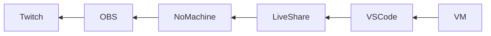
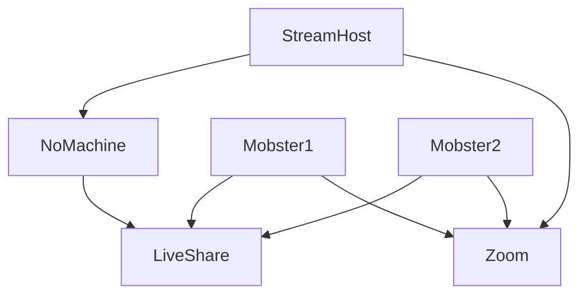
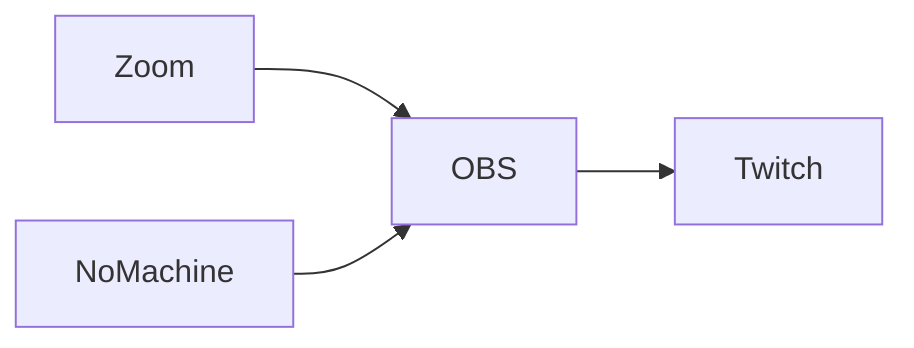

# Statebox Live Mob Programming

Using the Mob Programming methodology, we try to approach the problem of implementing Category Theory in Idris.

We have been doing these sessions for a while and decide to live stream those on twitch.tv so that you can learn with us as we stumble along.

The technicalities of doing this are a bit involved so this is a report on our first public attempt to try this.


### Overview

Let's start with the chain from the VM to Twitch.



We build a specialized machine image that we run in "teh cloud", more details about this later. This is the VM box in the picture above.

It is used to host the VSCode Liveshare session. The Desktop is shared with using the NoMachine remote desktop software.

We then use [OBS](https://obsproject.com/) (a very successful [GPL](https://github.com/obsproject/obs-studio) project) to stream the desktop from NoMachine to Twitch.

## Creating the VM

The source code for this machine can be found here: [`statebox/liveshare-vm`](https://github.com/statebox/livesharing-vm).

### Packer

We use [Packer](https://packer.io/) with a shell script `init.sh` to build the machine image. Packer supports [many targets](https://www.packer.io/docs/builders/index.html): various cloud providers but also local hosts such as [QEMU](https://www.packer.io/docs/builders/qemu.html) or [Virtualbox](https://www.packer.io/docs/builders/virtualbox-iso.html).

The Packer config can be found on the repo in [`packer.json`](https://github.com/statebox/livesharing-vm/blob/master/packer.json).

Packer is currently set up to produce an machine-image in the Google cloud by starting from the official Debian image and then run [`init.sh`](https://github.com/statebox/livesharing-vm/blob/master/init.sh) to setup the software.

After running `packer build -var-file=config.json packer.json` we get a ready to use development machine in the specified region.


(it says Ubuntu but thats just an old)

## Provisioning

Packer runs the `init.sh` shell script to install all the software and setup the machine.

https://github.com/statebox/livesharing-vm/blob/master/init.sh

Let's walk through this file and explain what happens.

### Base packages

```shell
#/bin/sh

DEBIAN_FRONTEND=noninteractive apt update -y
DEBIAN_FRONTEND=noninteractive apt install -y \
    task-lxde-desktop aptitude less vim-gtk \
    sakura git tig nmap htop
```

This first step installs a bunch of packages:

- `vim-gtk`
- `less`
- `git`

And some lesser known ones

- `htop` to inspect running processes, better `top`
- `nmap` to check the network and ports
- `sakura` a terminal
- `tig` interactive commandline git tool, bit like magit
- `aptitude` interactive `apt`

Finally the [task](https://wiki.debian.org/DebianDesktop/Tasks) `task-lxde-desktop` gives us a [LXDE](https://lxde.org/) desktop, which is minimal and doesn't use a lot of resources, which is great for a VM.

Because this is ran from a shell script we need to do a few more things:
- `-y`: tell `apt` to not ask for confirmations
- `DEBIAN_FRONTEND=noninteractive [cmd]` makes sure that the Debian Installer does not ask for input either

Great, next step.

### Non-packaged software

We download and install a number of tools that cannot be `apt` installed.

```shell
cd /tmp

echo  "installing nomachine"
curl -LO https://download.nomachine.com\
/download/6.6/Linux/nomachine_6.6.8_5_amd64.deb
dpkg -i nomachine_6.6.8_5_amd64.deb

echo  "installing vscode"
curl -Lo code_1.34.0-1557957934_amd64.deb \
    https://go.microsoft.com/fwlink/?LinkID=760868
dpkg -i code_1.34.0-1557957934_amd64.deb

cd
```

In general this isn't the best practise but it suffices for now.

Next up, Nix. As usual, it is a bit fiddly.

```shell
echo "install nix"
curl -Lo /tmp/nix-install.sh https://nixos.org/nix/install

echo "set sysctl kernel.unprivileged_userns_clone=1 for nix"
sysctl kernel.unprivileged_userns_clone=1

echo "install as wires user"
sudo su -l wires -c "sh /tmp/nix-install.sh"
```

The first thing to note is that we need to set a flag in the kernel to avoid [this issue](https://github.com/NixOS/nixpkgs/issues/61271).

We then use `su -l wires` to start the install script as the `wires` user. The username is set in `packer.json`, option `"ssh_username": "wires"`.

Okay, with nix installed, lets install node.

```shell
echo "install node js"
curl -LO https://nodejs.org/dist/v12.3.1/node-v12.3.1-linux-x64.tar.xz
tar xJvf node-v12.3.1-linux-x64.tar.xz
mv node-v12.3.1-linux-x64 /usr/local/
```

Here again we see some bad practise from a security point of view (downloading and installing "arbitary software" without checking any cryptographic signatures or audits).

We would never do this on a production machine image, but it's fine for this and in the future we will probably use Nix to manage all of this anyway.

### Configuration

Now that the required software is installed, we configure the system.

First we write a config file for NX, the remote desktop software.

```
cat << EOF > /usr/NX/etc/server.cfg
AcceptedWebMethods classic,webrtc
AvailableSessionTypes unix-remote,unix-console,unix-default,unix-application,physical-desktop,shadow
ClientConnectionMethods NX,SSH
ConfigFileVersion 4.0
EnablePasswordDB 1
EnableUPnP NX
EnableUserDB 1
EnableWebPlayer 1
NXPort 4000
SSHAuthorizedKeys authorized_keys
Section "Server"
DisplayGeometry 1280x800
Name "Connection to localhost"
Host 127.0.0.1
Protocol NX
Port 4000
Authentication password
EndSection
EOF
```

We run the server at `1280x800` resolution and on port `4000` and we enabled the user/password database with `EnablePasswordDB 1`.

Now we create a user `wires` and set the password to `geheim`.

```
# add user
sh -c "echo \"geheim\ngeheim\n\" | /usr/NX/bin/nxserver --useradd wires"
```

We do this by pretending with `echo` that we enter the password twice using `geheim\n`.

We won't expose the port to public internet but instead run a `ssh` tunnel to the *streamhost* machine, so this password being public is not an issue.

### Almost Done

All the tools are installed, we proceed by cloning some repos and setting up the `wires` user.

We need to do all of this as wires and not as root (`init.sh` runs as root), so what we do is create a file on the machine `/tmp/setup.sh` and run that as the `wires` user.

```shell
# install statebox software
cat << EOF > /tmp/setup.sh
# /bin/sh
«RUN_WHAT_IS_HERE_AS_THE_WIRES_USER»
EOF

# change owner to wires
chown wires /tmp/setup.sh

# execute as wires
sudo su -l wires -c "sh /tmp/setup.sh"
```

The contents of `setup.sh` (inserted into «RUN_WHAT_IS_HERE_AS_THE_WIRES_USER») are:

```shell
# install vsliveshare plugin
code --install-extension ms-vsliveshare.vsliveshare
code --install-extension zjhmale.idris

# install elba, the idris package manager
mkdir -p bin
cd bin
curl -LO https://github.com/elba/elba/releases/download/0.2.0/elba-0.2.0-x86_64-unknown-linux-gnu.tar.gz
tar xzvf elba-0.2.0-x86_64-unknown-linux-gnu.tar.gz
rm elba-0.2.0-x86_64-unknown-linux-gnu.tar.gz

# store code in ~/code/
cd
mkdir -p code/statebox code/typedefs
git clone https://github.com/typedefs/typedefs code/typedefs/typedefs.git
git clone https://github.com/statebox/idris-ct code/statebox/idris-ct.git
```

The last thing we do is warm up the `/nix` store, because this would take a long time otherwise.

```shell
cd ~/code/typedefs/typedefs.git
echo exit | nix-shell -A typedefs
cd ~/code/statebox/idris-ct.git
echo exit | nix-shell -A idris-ct
```

And there you have it, a minimal Debian machine with various dev tools installed.


## Usage

### During The session



All the participants in the Mob Programming session (mobsters) connect to Zoom and Liveshare.

The stream host connects to NoMachine and hosts the liveshare session from there.

### Stream Host, creating VM and connecting to NX

The first thing that you need to do is create a VM in the Google console and change the image to the packer image `u16demo-155...`.

Let's call the VM `liveshare`.

To use the machine, I login to it by forwarding my `ssh-agent` (using `-A`) and setting up a ssh tunnel to the NX port, as follows:

```
gcloud compute --project "statebox-infra" ssh --zone "europe-west4-a" "liveshare" -- -A -L 4555:localhost:4000
```

Now, my SSH keys are available on the machine and I can push changes to git, clone private repos or login to other machines.

To connect to the machine I create a connection in NX to `localhost:4555`.


### Streaming Setup





The stream host runs the OBS streaming software on their workstation and grabs the visuals from NoMachine and Zoom and composes this into what you see on the Twitch stream.

#### Audio

And let's not forget the **audio** from Zoom, it is a bit tricky to get right; we need to create an *Audio Input Capture* device in OBS, but which device do we capture?


(don't forget to transition to the scene, or the mixer won't show up)

To get a device that we can capture, we recommend installing [iShowU Audio Capture](https://support.shinywhitebox.com/hc/en-us/articles/204161459-Installing-iShowU-Audio-Capture).

This creates a virtual audio device that you can now use listen to from within OBS. Select the "iShow Audio Capture" device.


We also need to tell Zoom (and other software) to use this device instead of our speakers. Open "Audio/MIDI Setup" and select "Use this for default sound output".


Now, Zoom audio will go into that device and OBS will pick it up.

But, you won't hear the Zoom sound anymore. Aren't computers just wonderful?

To solve this, I just open Zoom on a mobile phone and use that to speak and listen.

